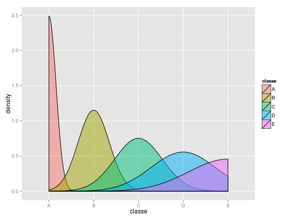
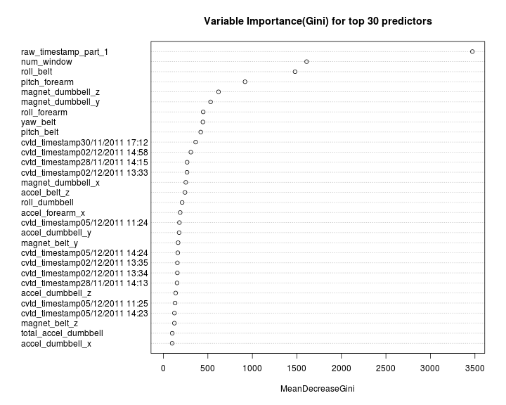
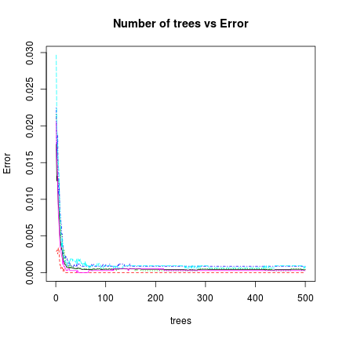

Human Activity Interaction - Exercise Classification
========================================================
Objective of this is to build a model to predict the type of exerciese (classe in the dataset) using data collected from accelerometers on the belt, forearm, arm, and dumbell of 6 participants.

#### Data

Training data set : <a href="https://d396qusza40orc.cloudfront.net/predmachlearn/pml-training.csv">pml-training.csv</a>

Testing data set : <a href="https://d396qusza40orc.cloudfront.net/predmachlearn/pml-testing.csv">pml-testing.csv</a>

Please refer to  <a href="http://groupware.les.inf.puc-rio.br/har">groupware</a> site for more details which is the source of this data


```r
suppressPackageStartupMessages(library(caret))
suppressPackageStartupMessages(library(randomForest))
setwd("~/coursera/pml/")
pml <- read.csv("data/pml-training.csv", na.string = "#DIV/0!")
pml_names <- names(pml)
testing <- read.csv("data/pml-testing.csv", na.string = "#DIV/0!")
predict_columns = c(3:11, 37:45, 46:49, 60:68, 84:86, 102, 113:121, 122:124, 
    140, 151:159, 160)
trainig <- pml[, predict_columns]
```


After analyzing the data set and looking at each variable, following list of variables have been identifed as the predictors. Some of the other variables looks to be more derived from the basic mesured values. Ignored the variables like the user_name, etc


```r
pml_names[predict_columns]
```

```
##  [1] "raw_timestamp_part_1" "raw_timestamp_part_2" "cvtd_timestamp"      
##  [4] "new_window"           "num_window"           "roll_belt"           
##  [7] "pitch_belt"           "yaw_belt"             "total_accel_belt"    
## [10] "gyros_belt_x"         "gyros_belt_y"         "gyros_belt_z"        
## [13] "accel_belt_x"         "accel_belt_y"         "accel_belt_z"        
## [16] "magnet_belt_x"        "magnet_belt_y"        "magnet_belt_z"       
## [19] "roll_arm"             "pitch_arm"            "yaw_arm"             
## [22] "total_accel_arm"      "gyros_arm_x"          "gyros_arm_y"         
## [25] "gyros_arm_z"          "accel_arm_x"          "accel_arm_y"         
## [28] "accel_arm_z"          "magnet_arm_x"         "magnet_arm_y"        
## [31] "magnet_arm_z"         "roll_dumbbell"        "pitch_dumbbell"      
## [34] "yaw_dumbbell"         "total_accel_dumbbell" "gyros_dumbbell_x"    
## [37] "gyros_dumbbell_y"     "gyros_dumbbell_z"     "accel_dumbbell_x"    
## [40] "accel_dumbbell_y"     "accel_dumbbell_z"     "magnet_dumbbell_x"   
## [43] "magnet_dumbbell_y"    "magnet_dumbbell_z"    "roll_forearm"        
## [46] "pitch_forearm"        "yaw_forearm"          "total_accel_forearm" 
## [49] "gyros_forearm_x"      "gyros_forearm_y"      "gyros_forearm_z"     
## [52] "accel_forearm_x"      "accel_forearm_y"      "accel_forearm_z"     
## [55] "magnet_forearm_x"     "magnet_forearm_y"     "magnet_forearm_z"    
## [58] "classe"
```


Let's look at the density plot of the subset of data


```r
qplot(classe, data = trainig, geom = "density", fill = classe, alpha = I(0.5))
```

 


It shows, there is a clear pattern in the data set to differentiate the 5 different types of exercise (A,B,C,D,E)

Let us use the random forest to build the classification model. In random forest, there is no need to for cross-validation or a seperate test test to get un biased estimate of the test set error. It is estimated internally.


```r
# Please note building model takes good amout of computer resoruces and
# takes lot of time if you are going to run this locally. please change
# eval=TRUE I have saved the model object and loading in next step below so
# that there is no need to run the whole model again

modFit1 <- train(classe ~ ., data = training, method = "rf", trControl = trainControl(method = "oob"))
fit <- modFit1$finalModel
```


```r
load("model/fit.rda")
confusion = fit$confusion
sensitivity = (confusion[2, 2]/(confusion[2, 2] + confusion[2, 1])) * 100
specificity = (confusion[1, 1]/(confusion[1, 1] + confusion[1, 2])) * 100
overall_error = fit$err.rate[length(fit$err.rate[, 1]), 1] * 100
overall_accuracy = 1 - overall_error
class1_error = paste(rownames(confusion)[1], " error rate= ", confusion[1, 3], 
    sep = "")
class2_error = paste(rownames(confusion)[2], " error rate= ", confusion[2, 3], 
    sep = "")
overall_accuracy = 100 - overall_error
```


Let's look at the random forest model object to understand how the model has performed.


```r
summary(fit)
```

```
##                 Length Class      Mode     
## call                4  -none-     call     
## type                1  -none-     character
## predicted       19622  factor     numeric  
## err.rate         3000  -none-     numeric  
## confusion          30  -none-     numeric  
## votes           98110  matrix     numeric  
## oob.times       19622  -none-     numeric  
## classes             5  -none-     character
## importance         75  -none-     numeric  
## importanceSD        0  -none-     NULL     
## localImportance     0  -none-     NULL     
## proximity           0  -none-     NULL     
## ntree               1  -none-     numeric  
## mtry                1  -none-     numeric  
## forest             14  -none-     list     
## y               19622  factor     numeric  
## test                0  -none-     NULL     
## inbag               0  -none-     NULL     
## xNames             75  -none-     character
## problemType         1  -none-     character
## tuneValue           1  data.frame list     
## obsLevels           5  -none-     character
```


#### Sensitivity = 99.9737
#### Specificity = 100

#### Overall Error = 0.0408
#### Overall Accuracy = 99.9592 

Following plot shows importance of variables


```r
varImpPlot(fit, type = 2, n.var = 30, scale = FALSE, main = "Variable Importance(Gini) for top 30 predictors")
```

 


Following plot shows the relation between # of trees and the error. Pelase note that the Error stabilizes after certain # of trees


```r
plot(fit, main = "Number of trees vs Error")
```

 

